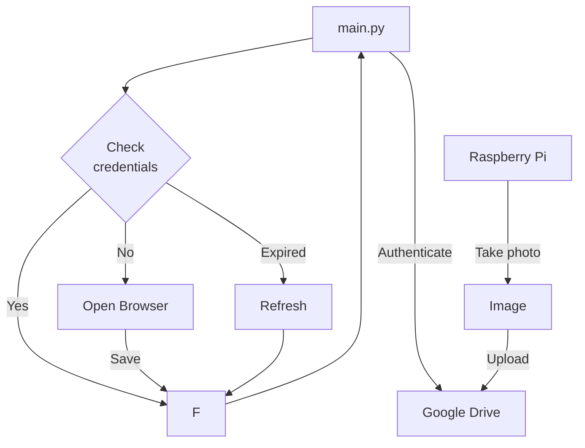

# upload-lab-photo

This is a Python code to upload photos taken by Raspberry Pi to Google Drive. By using cron for interval shooting, you can check the current state of the laboratory.
Additionally, by combining it with YOLO, you can check the number of people present.

Raspberry Pi により撮影した写真をGoogle Drive にアップロードするPythonコードです。
cron によるインターバル撮影により研究室の現在の様子を確認することができます。
またyoloを組み合わせることで在室人数を確認することができます。
# DEMO


# Features
By specifying the ID on Google Drive, the photos will be overwritten. This ensures there is no worry about consuming too much storage space.

Google Drive上のidを指定することで写真を上書きします。容量を圧迫する心配がないです。

# Requirement

* Python 3.9.2
* PyDrive 1.3.1
* python-dotenv 1.0.1 (Additional)

# Installation

Install PyDrive (and python-dotenv) with pip command.

pipコマンドでPyDrive(、python-dotenv)をインストールしてください。

```bash
pip３ install PyDrive
pip3 install python-dotenv
```

# Usage

Clone the repository and Run "main.py" in the directory.

リポジトリをクローンし、ディレクトリ内にある"main.py"を実行してください。

```bash
git clone https://github.com/daikidaiku/upload-lab-photo
cd upload-lab-photo
python3 main.py
```

# Note

Since authentication is required for the first time, please use a smartphone or other device to authenticate as needed.

初回は認証が必要となるため、適宜スマートフォン等を利用し認証してください。

# Author

* daiki_daiku
* Waseda University
* Twitter : https://twitter.com/daiki_da1ku

# License

upload-lab-photo is under [MIT license](https://en.wikipedia.org/wiki/MIT_License).